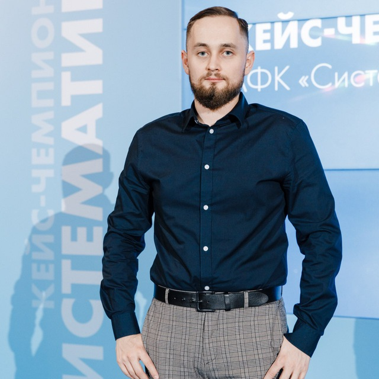

## **Портфолио Баландина Виктора Алексеевича.**
# 
**Я начинающий тестировщик. Хочу рассказать, что я уже умею.**

_На текущий момент я уже научился:_
1. Работать с локальными репозиториями и терминалом.
2. Связывать удаленный и локальный репозитории.
3. Освоил инструменты для командной работы. 
4. Научился работать с инструментом Pages